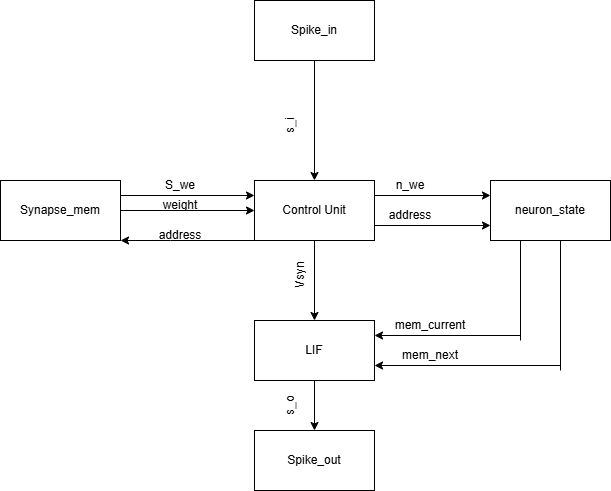

<!---

This file is used to generate your project datasheet. Please fill in the information below and delete any unused
sections.

You can also include images in this folder and reference them in the markdown. Each image must be less than
512 kb in size, and the combined size of all images must be less than 1 MB.
-->

## Spiking Pattern Detector

Spiking Pattern Detector is an application of a parameterised neuromorphic processing core, implementing a 4-neuron Spiking Neural Network (SNN) with fixed-point precision (Q8.8). The system generates an event when the temporal spike response of an input signal matches a user-defined pattern.

The core employs a discretised Leaky Integrate-and-Fire Model with a one-to-one neuron–synapse mapping. Synaptic weights are static, and the design operates without online learning (e.g. STDP).

This architecture serves as a foundation for exploring event-driven computation systems, including:

- Real-time signal processing (event-based DSP / sparse filtering)
- Temporal pattern recognition in spike-based data streams
-Robotic sensing and reflex systems (low-latency event detection)

## How to test

Just trust me bro

## External hardware

Patience and faith
